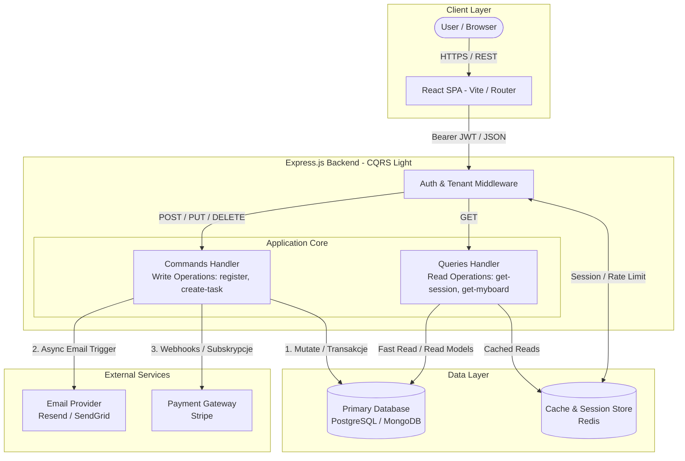

# Board 1 - High-Level Architecture Context

## PART A: Core Business Domains (Bounded Contexts)

### 1. Identity & Access Context

Responsibility:

- User authentication
- Session management
- User identity as a technical entity

Scope:

- User
- Session
- Invite token (temporary)
- Credential lifecycle

Rules:

- Identity ≠ Membership
- No knowledge of organizations, projects, or domain roles
- Provides only: "who the user is" + "whether they are logged in"

### 2. Organization / Tenant Context

Responsibility:

- Tenant (organization) management
- Membership and its lifecycle
- Organizational structure

Scope:

- Organization
- Membership
- Team
- Roles assigned within the context of an organization

Rules:

- Every operation takes place within the context of an organization
- User can belong to multiple organizations
- Membership is a durable entity

### 3. Collaboration Context

Responsibility:

- Collaborative work on artifacts
- Sharing and editing rules

Scope:

- Project
- Board
- Task
- TaskHistory

Rules:

- Aggregates:
  - Project → Board
  - Board → Task
  - Task → History
- Local consistency per aggregate
- No dependency on UI

### 4. Notification / Communication Context

Responsibility:

- Asynchronous event communication
- Informing users about changes

Scope:

- Domain Events (e.g., TaskAssigned, MemberInvited)
- Notification Intent
- Recipient Resolution
- Communication Channels

Rules:

- Communication is a side effect
- No impact on the result of domain operations
- No synchronization with the core flow

## PART B: Technical & Infrastructure Capabilities

### 1. Persistence & State Management

Responsibility:

- Persistence and recoverability of system state
- Audit and history

State Types:

- Durable State (Organizations, Projects, Tasks)
- Ephemeral State (Sessions, Invites)
- Historical State (TaskHistory)
- Derived State (KPIs, views)

Rules:

- Persisted state is the source of truth
- Consistency at the aggregate level
- Tenant data isolation

### 2. Observability & Reliability

Responsibility:

- System state visibility
- Protective mechanisms

Scope:

- Signals (metrics, logs, events)
- Health State
- Control Policies (rate limiting, feature gating)
- Audit Signals

Rules:

- Observes, does not make domain decisions
- Does not modify business state
- Can limit, block, alert

[⬅️ **back**](../../ARCHITECTURE.md)
