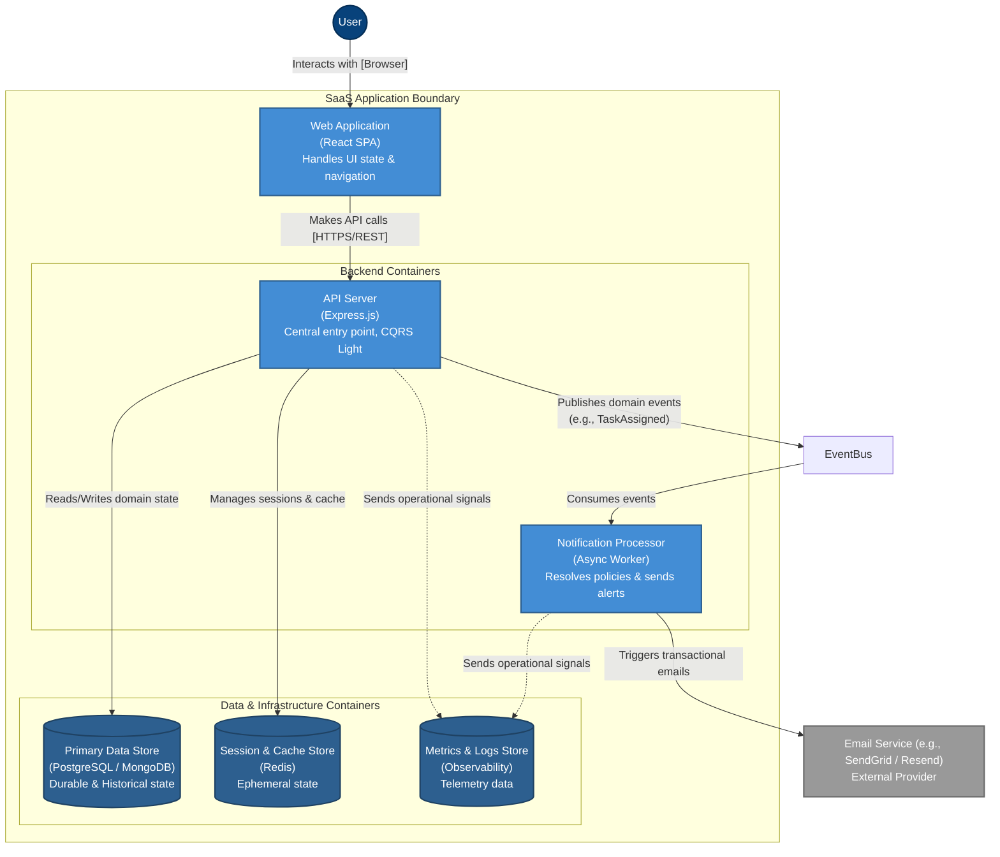

# Board 2 - Container Architecture Overview

## Purpose

Defines the main runtime containers of the system, their responsibilities and communication paths, without exposing low-level implementation details.

## PART A: Client Container

### Web Application (Browser)

- Single-page application used by end users
- Handles user interaction, navigation and UI state
- Translates user actions into API requests
- Does not contain business logic

Responsibilities:

- User Interaction Context
- Client-side state and feedback

## PART B: Backend Containers

### API Server

- Central entry point for all client requests
- Exposes application API
- Validates identity and request context
- Orchestrates domain use cases
- Internally separated into Command (Write) and Query (Read) logical pipelines (CQRS Light).
  Responsibilities:

- Identity & Access
- Organization / Tenant
- Collaboration
- Notification triggering

### Notification Processor

- Asynchronous worker reacting to domain events
- Resolves recipients and communication policies
- Sends notifications via external channels
- API Server → Message Broker (Redis/RabbitMQ) → Notification Processor
  Responsibilities:

- Notification / Communication Context

Notes:

- Fully decoupled from request lifecycle
- Failure does not affect core workflows

## Data Containers

### Primary Data Store

- Persistent storage for domain state
- Tenant-isolated data model
- Stores durable, ephemeral and historical state

Responsibilities:

- Persistence & State Context

### Session & Cache Store (Redis)

- In-memory data store for high-performance reads
- Manages ephemeral state
  Responsibilities:
- Session management (Identity Context)
- Rate limiting data
- Query caching (Read Models)

---

### Metrics & Logs Store

- Collects operational signals
- Stores metrics, logs and audit events

Responsibilities:

- Observability / Control Context

## External Containers

### Email Service

- External communication provider
- Sends transactional emails (invites, alerts)

Used by:

- Notification Processor

## Container Communication

- Web Application → API Server (synchronous)
- API Server → Primary Data Store (synchronous)
- API Server → Notification Processor (asynchronous event)
- Notification Processor → Email Service (asynchronous)
- All containers → Metrics & Logs Store

## Container-Level Principles

- Clear responsibility per container
- Stateless application containers
- Asynchronous side-effects
- Infrastructure isolated from domain logic
- Containers map directly to architectural contexts

## Result

A clean, scalable container architecture aligned with domain boundaries, suitable for real-world multi-tenant collaboration systems.
