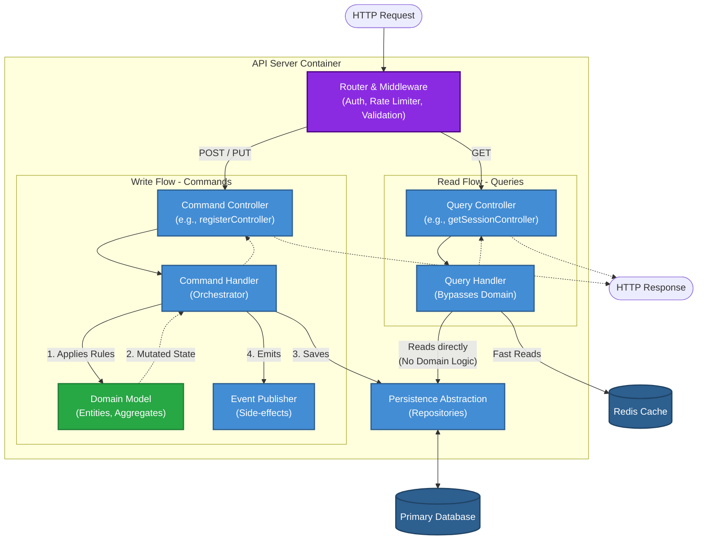

# Board 3 - Component Architecture Overview

## Purpose

Describes the internal structure of the main application container, focusing on components, their responsibilities and interaction patterns.

This level explains **how the system is organized internally**, without going down to classes or functions.

## Scope

Board 3 focuses on the **API Server container**, as it contains the core domain logic.

## API Server – Component Structure

### 1. API / Controller Layer

Responsibilities:

- Receives HTTP requests
- Validates request shape and context
- Translates requests into application-level commands
- Returns responses

Characteristics:

- Stateless
- No business logic
- No direct data access

---

### 2A. Command Handlers (Write Model)

Responsibilities:

- Executes state-mutating operations (e.g., create-task, assign-user).

- Orchestrates the 6-step command execution pipeline (Validation, Auth, Load, Mutate, Save, Emit).

- Coordinates transactional boundaries.

Characteristics:

- Action-verb naming convention.

- Always delegates business rules to the Domain Layer.

---

### 2B. Query Handlers (Read Model)

Responsibilities:

- Handles data retrieval operations (e.g., get-board, get-session).

- Optimizes payloads for specific UI views.

Characteristics:

- get- naming convention.

- Bypasses the Domain Layer to query the Persistence Abstraction or Read Models directly for maximum performance.

---

### 3. Domain Layer

Core business logic of the system.

Responsibilities:

- Domain models and aggregates
- Business rules and invariants
- State transitions
- Domain events

Key aggregates:

- Organization
- Project
- Board
- Task

Characteristics:

- Framework-agnostic
- No infrastructure dependencies
- Enforces consistency rules

---

### 4. Authorization Component

Responsibilities:

- Evaluates permissions in domain context
- Resolves roles and access scopes
- Guards domain operations

Characteristics:

- Used by application layer
- Context-aware (organization, project, board)
- No knowledge of UI

---

### 5. Persistence Abstraction

Responsibilities:

- Provides access to stored domain state
- Maps aggregates to persistence format
- Ensures tenant isolation

Characteristics:

- Repository-based access
- No business logic
- Implementation hidden behind interfaces

---

### 6. Event Publishing Component

Responsibilities:

- Emits domain events after state changes
- Decouples side-effects from core logic

Characteristics:

- Fire-and-forget
- No knowledge of subscribers
- Used by application layer

---

### 7. Observability Hooks

Responsibilities:

- Emits logs, metrics and audit signals
- Tracks system behavior and anomalies

Characteristics:

- Passive
- No influence on domain outcomes
- Cross-cutting concern

---

## Component Communication Flow (CQRS Light)

**Write Flow (Commands):**

1. Controller receives POST/PUT/DELETE request.

2. Command Handler orchestrates the use case.

3. Authorization Component verifies permissions.

4. Domain Model enforces rules and changes state.

5. Persistence Abstraction saves the aggregate.

6. Event Publishing emits domain events (side-effects).

---

**Read Flow (Queries):**

1. Controller receives GET request.

2. Query Handler validates parameters.

3. Authorization Component verifies view permissions.

4. Query Handler bypasses Domain and requests data directly from Persistence Abstraction (or Cache).

5. Optimized Read Model is returned to the client.

## Component-Level Principles

- Clear responsibility per component
- Dependency flow inward (API → command/query → Domain)
- Domain independent from infrastructure
- Side-effects handled asynchronously
- No UI or transport logic inside domain

## Result

A clean internal architecture that:

- Protects the domain
- Enables independent evolution of components
- Scales with system complexity
- Maps directly to higher-level architectural contexts
