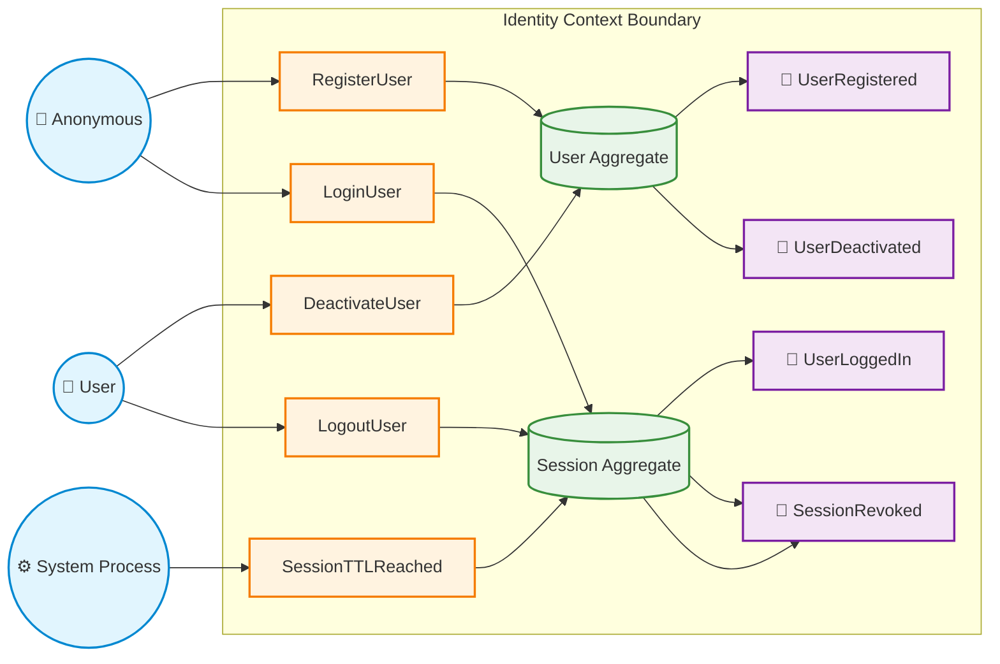

# Domain Model Specification: Identity context

# Domain Model Specification: Identity & Session

## 0. Purpose

This module serves as the core foundation of system security and is solely responsible for **global user identity** and **authentication**. It operates in complete isolation from any organizational structures, teams, or projects. It answers one fundamental question: _"Who is the person making the request, and can we cryptographically verify their identity?"_.

### Core Responsibilities

- **Credential Storage:** Securely managing and storing user authentication credentials (passwords, email addresses).
- **Account Lifecycle:** Managing user account states (`Draft` -> `Active` -> `Deactivated`).
- **Session Management:** Handling device session lifecycles (creation, refresh, revocation, and TTL expiration).
- **Token Issuance:** Issuing base identity tokens (_Identity-bound Sessions_) that downstream contexts can extend.

---

## 1. Actors

- **Anonymous**: Unauthenticated requestor interacting with public endpoints (e.g., registration, login, password reset).
- **User**: An authenticated individual holding a verified global identity.
- **System**: Automated background processes, scheduled handlers, or security monitor services.

---

## 2. Aggregates & Invariants

### User (Aggregate Root)

- `User.id` must be unique across the system.
- `User.email` must be unique (case-insensitive).
- A User cannot have more than 1 active session per device.
- A User must have at most `MAX_ACTIVE_SESSIONS` active sessions.
- `User.ownershipCount <= MAX_OWNED_ORGANIZATIONS`.
- `User.membershipCount <= MAX_MEMBERSHIPS`.
- If `User.state == Deactivated`:
  - All user sessions must be immediately `Revoked`.
  - For every associated Membership, either `Organization.archived == true` **OR** `Membership.state == Suspended`.
  - A deactivated User cannot own any active Organization.

---

### Session (Aggregate Root)

- `Session.id` must be unique.
- Session must belong to **exactly one** `User`.
- `Session.tenantContext` $\in$ `{null, organizationId}`.
- A Tenant-bound session (`tenantContext != null`) requires an active Organization Membership.
- Expired or Revoked sessions are terminal and cannot transition back to `Active`.

---

## 3. State Machines

### User

- **States:** `Draft`, `Active`, `Deactivated`
- **Transitions:**
  - `Draft` -> `Active` via `RegisterUser`
  - `Active` -> `Deactivated` via `DeactivateUser`
  - `Deactivated` -> _(Terminal)_

---

### Session

- **States:** `Draft`, `Active(Identity)`, `Active(Tenant)`, `Expired`, `Revoked`
- **Transitions:**
  - `Draft` -> `Active(Identity)` via `RegisterUser` or `LoginUser`
  - `Active(Identity)` -> `Active(Tenant)` via `SelectTenant`
  - `Active(Tenant)` -> `Active(Tenant)` via `SelectTenant`
  - `Active(Tenant)` -> `Active(Identity)` via `Track/SuspendMembership`
  - `Active(any)` -> `Expired` via `SessionTTLReached` _(System process)_
  - `Active(any)` -> `Revoked` via `LogoutUser` or `DeactivateUser`
  - `Expired` -> _(Terminal)_
  - `Revoked` -> _(Terminal)_

---

## 4. Commands

### User Commands

#### Command: `RegisterUser`

- **Actor:** Anonymous
- **Target:** User
- **Preconditions:**
  - `email` is unique (case-insensitive)
  - `device.session.active == false`
- **Effects:**
  - Create `User` (`state = Active`)
  - Create `Session` (`type = Identity`, `state = Active`)
- **Emit:** `UserRegistered`, `UserLoggedIn`
- **Errors:** `EmailAlreadyExists`, `ActiveSessionExists`

#### Command: `DeactivateUser`

- **Actor:** User
- **Target:** User
- **Preconditions:**
  - For every owned organization, `Organization.archived == true` **OR** `Membership.state == Suspended`
  - Every `Membership.role != OrgOwner` when `Organization.archived == false`
- **Effects:**
  - `User.state = Deactivated`
  - Revoke all active sessions belonging to User
- **Emit:** `UserDeactivated`, `SessionRevoked`
- **Errors:** `ActiveOwnershipExists`, `InvalidUserState`

#### Command: `ChangeUserEmail`

- **Actor:** User
- **Target:** User
- **Preconditions:**
  - `User.state == Active`
  - `newEmail` is unique (case-insensitive)
- **Effects:**
  - `User.email = newEmail`
- **Emit:** `UserEmailChanged`
- **Errors:** `EmailAlreadyTaken`, `InvalidEmailFormat`, `UserInactive`

#### Command: `RequestPasswordReset`

- **Actor:** Anonymous
- **Target:** User
- **Preconditions:**
  - User with provided email exists
- **Effects:**
  - Generate `PasswordResetToken` (with TTL)
- **Emit:** `PasswordResetRequested`
- **Errors:** `UserNotFound`

#### Command: `ResetPassword`

- **Actor:** Anonymous
- **Target:** User
- **Preconditions:**
  - Valid `PasswordResetToken`
  - Token is not expired
- **Effects:**
  - Update `User.passwordHash`
  - Invalidate used reset token
- **Emit:** `PasswordChanged`
- **Errors:** `InvalidToken`, `TokenExpired`

---

### Session Commands

#### Command: `LoginUser`

- **Actor:** Anonymous
- **Target:** User
- **Preconditions:**
  - Target User exists and `User.state == Active`
  - Valid credentials (password/MFA)
  - `device.session.active == false`
  - `User.activeSessionsCount < MAX_ACTIVE_SESSIONS`
- **Effects:**
  - Create `Session` (`type = Identity`, `state = Active`)
- **Emit:** `UserLoggedIn`
- **Errors:** `InvalidCredentials`, `UserDeactivated`, `ActiveSessionExists`, `MaxSessionsExceeded`

#### Command: `SelectTenant`

- **Actor:** User
- **Target:** Session
- **Preconditions:**
  - `Session.state == Active`
  - Target `Organization` exists
  - `Membership(userId, organizationId)` exists AND `Membership.state == Active`
- **Effects:**
  - Update or re-issue `Session` (`type = TenantBound`, `tenantContext = organizationId`)
- **Emit:** `TenantSelected`
- **Errors:** `MembershipNotFound`, `MembershipInactive`, `OrganizationNotFound`

#### Command: `LogoutUser`

- **Actor:** User
- **Target:** Session
- **Preconditions:**
  - `Session.state == Active`
- **Effects:**
  - `Session.state = Revoked` (soft delete / invalidate token)
- **Emit:** `SessionRevoked`, `UserLoggedOut`
- **Errors:** `SessionAlreadyInvalid`

#### Command: `SessionTTLReached` _(System Process)_

- **Actor:** System
- **Target:** Session
- **Preconditions:**
  - `currentTime > Session.expiresAt`
  - `Session.state == Active`
- **Effects:**
  - `Session.state = Expired`
- **Emit:** `SessionRevoked`

---

### User Profile Commands

#### Command: `ChangeUserDisplayName`

- **Actor:** User
- **Target:** User
- **Preconditions:**
  - `User.state == Active`
- **Effects:**
  - `User.displayName = newDisplayName`
- **Emit:** `UserProfileUpdated`
- **Errors:** `UserInactive`

#### Command: `UpdatePreferences`

- **Actor:** User
- **Target:** User
- **Preconditions:**
  - `User.state == Active`
- **Effects:**
  - Update `User.preferences`
- **Emit:** `UserPreferencesUpdated`
- **Errors:** `UserInactive`

---

## 5. Domain Events

### User Events

- **`UserRegistered`**  
  _Payload:_ `userId`, `email`
- **`UserDeactivated`**  
  _Payload:_ `userId`
- **`UserEmailChanged`**  
  _Payload:_ `userId`, `oldEmail`, `newEmail`
- **`PasswordResetRequested`**  
  _Payload:_ `userId`, `email`, `tokenExpiresAt`
- **`PasswordChanged`**  
  _Payload:_ `userId`
- **`UserProfileUpdated`**  
  _Payload:_ `userId`, `displayName`
- **`UserPreferencesUpdated`**  
  _Payload:_ `userId`, `preferences`

---

### Session Events

- **`UserLoggedIn`**  
  _Payload:_ `userId`, `sessionId`, `deviceId`
- **`UserLoggedOut`**  
  _Payload:_ `userId`, `sessionId`
- **`TenantSelected`**  
  _Payload:_ `userId`, `sessionId`, `organizationId`
- **`SessionRevoked`**  
  _Payload:_ `sessionId`, `userId`, `reason`
