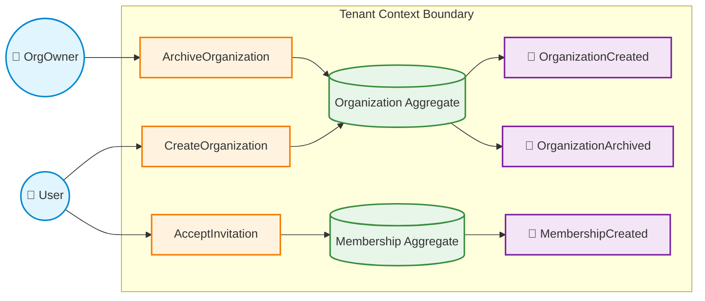
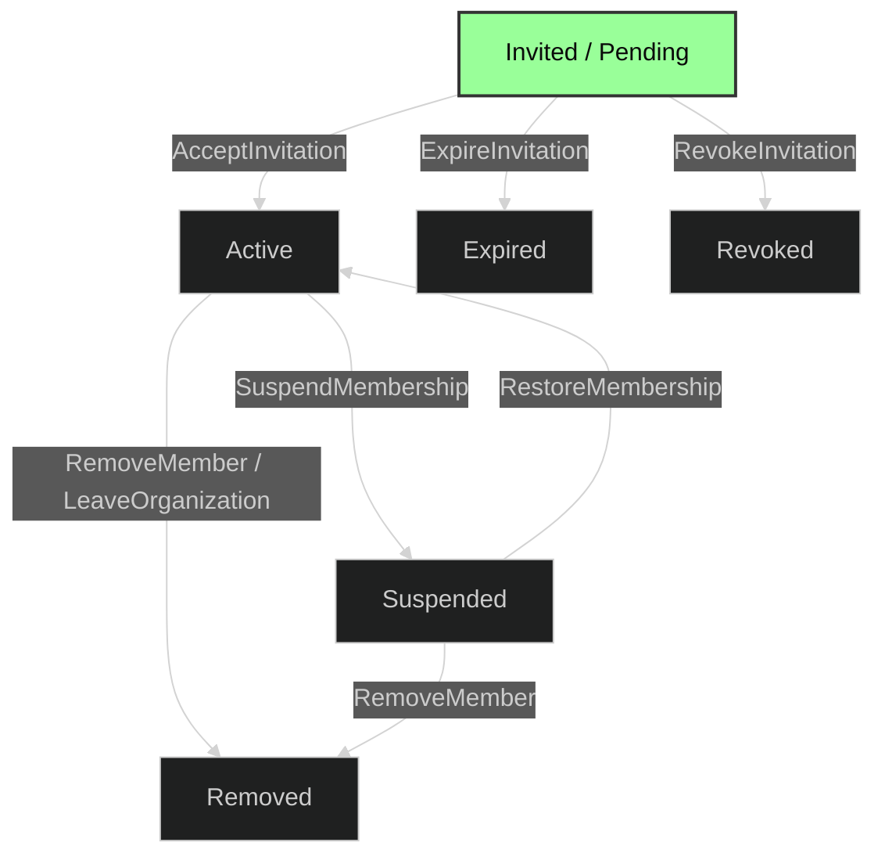
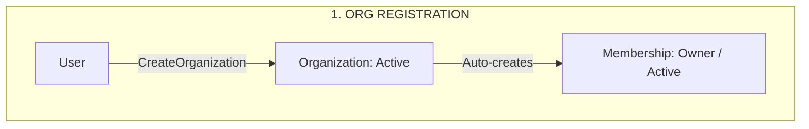
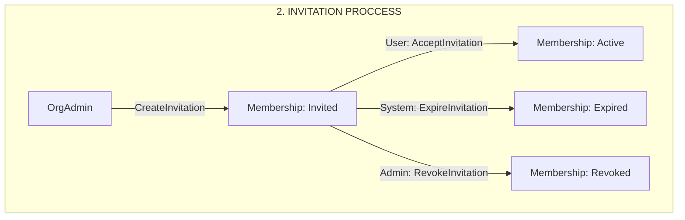

# Domain Model Specification: Tenant context

## 0. Purpose

This module implements the multi-tenant architecture and is responsible for **workspace isolation, membership management, and access control** (Authorization / RBAC). It acts as a bridge between global identity (_Identity Context_) and domain execution (_Collaboration Context_). It answers the question: _"Which organizations does this user belong to, and what permissions do they hold within each?"_.

### Core Responsibilities

- **Tenant Lifecycle:** Managing the lifecycle of isolated organization spaces (Tenants).
- **Invariant Enforcement:** Guaranteeing strict business rules (e.g., maximum owned organizations, single-owner constraints).
- **Onboarding & Access:** Handling user onboarding via invitations (`Invitations`) and establishing membership records (`Membership`).
- **Team Structuring:** Grouping users into functional units (`Teams`) within an organization.
- **Context Enrichment:** Elevating base identity sessions into execution contexts (_Tenant-bound Sessions_).

## 1. Actors

- **User**: An authenticated user within the system.
- **OrgOwner**: A User holding the `Owner` role for a specific Organization.
- **OrgAdmin**: A User holding either the `Owner` or `Admin` role for a specific Organization.
- **System**: Automated background processes or system handlers.

---

## 2. Aggregates & Invariants

### Organization (Aggregate Root)

- `Organization.id` must be unique.
- Organization must always have **exactly one** `Active` Owner membership.
- `Organization.archived == true` implies the organization is read-only.
- An archived organization cannot accept new memberships, create teams, or create projects.
- `Organization.memberCount <= MAX_ORG_MEMBERS`.
- Organization owns every resource created within its boundaries.

---

### Membership (Aggregate Root)

- Represents the relationship between a single `User` and a single `Organization`.
- `Membership(userId, organizationId)` pair must be unique.
- `Membership.role` ∈ `{Owner, Admin, Member}`.
- `Membership.state` ∈ `{Invited, Active, Suspended, Removed, Expired, Revoked}`.
- Only an `Active` membership can perform organization-scoped actions.
- The `Owner` membership must always remain `Active` and cannot transition to `Suspended` or `Removed` without transferring ownership first.
- A `Removed`, `Expired`, or `Revoked` membership cannot perform any actions.

---

## 3. State Machines

### Organization

- **States:** `Draft`, `Active`, `Archived`
- **Transitions:**
  - `Draft` -> `Active` via `CreateOrganization`
  - `Active` -> `Archived` via `ArchiveOrganization`
  - `Archived` -> `Active` via `RestoreOrganization`

---

### Membership (User ↔ Organization)

- **States:** `Invited`, `Active`, `Suspended`, `Removed`, `Expired`, `Revoked`
- **Transitions:**
  - _(None)_ -> `Invited` via `CreateInvitation`
  - `Invited` -> `Active` via `AcceptInvitation`
  - `Invited` -> `Expired` via `ExpireInvitation` _(System process)_
  - `Invited` -> `Revoked` via `RevokeInvitation`
  - `Active` -> `Suspended` via `SuspendMembership`
  - `Suspended` -> `Active` via `RestoreMembership`
  - `Active` -> `Removed` via `RemoveMember` or `LeaveOrganization`
  - `Suspended` -> `Removed` via `RemoveMember`

---

## 4. Commands

### Organization Commands

#### Command: `CreateOrganization`

- **Actor:** User
- **Target:** Organization
- **Preconditions:**
  - `User.state == Active`
  - `User.ownershipCount < MAX_OWNED_ORGANIZATIONS`
- **Effects:**
  - Create `Organization` (`state = Active`)
  - Create `Membership` (`userId = Actor.userId`, `role = Owner`, `state = Active`)
  - `User.ownershipCount += 1`
- **Emit:** `OrganizationCreated`, `MemberInvited` / `MembershipCreated`

#### Command: `ArchiveOrganization`

- **Actor:** OrgOwner
- **Target:** Organization
- **Preconditions:**
  - `Organization.archived == false`
  - `Actor.membership.role == Owner`
  - `Actor.membership.state == Active`
- **Effects:**
  - `Organization.archived = true`
- **Emit:** `OrganizationArchived`
- **Errors:** `AlreadyArchived`, `Unauthorized`

#### Command: `RestoreOrganization`

- **Actor:** OrgOwner
- **Target:** Organization
- **Preconditions:**
  - `Organization.archived == true`
  - `Actor.membership.role == Owner`
  - `Actor.membership.state == Active`
- **Effects:**
  - `Organization.archived = false`
- **Emit:** `OrganizationRestored`
- **Errors:** `NotArchived`, `OwnerInactive`

#### Command: `TransferOwnership`

- **Actor:** OrgOwner
- **Target:** Membership
- **Preconditions:**
  - `Organization.archived == false`
  - `TargetMembership.role == Admin`
  - `TargetMembership.state == Active`
- **Effects:**
  - `CurrentOwnerMembership.role = Admin`
  - `TargetMembership.role = Owner`
- **Emit:** `OwnershipTransferred`
- **Errors:** `InvalidMembershipState`, `TargetMustBeAdmin`

---

### Membership Commands

#### Command: `CreateInvitation`

- **Actor:** OrgAdmin
- **Target:** Membership
- **Preconditions:**
  - `Organization.archived == false`
  - Target `User` exists in the system
  - `Membership(targetUserId, organizationId)` does not exist
  - `Organization.memberCount < MAX_ORG_MEMBERS`
- **Effects:**
  - Create `Membership` (`userId = targetUserId`, `role = AssignedRole`, `state = Invited`, `expiresAt = currentTime + TTL`)
- **Emit:** `MemberInvited`
- **Errors:** `MembershipAlreadyExists`, `OrganizationArchived`, `MemberLimitReached`

#### Command: `AcceptInvitation`

- **Actor:** User
- **Target:** Membership
- **Preconditions:**
  - `Membership.userId == Actor.userId`
  - `Membership.state == Invited`
  - `currentTime <= Membership.expiresAt`
  - `Organization.archived == false`
- **Effects:**
  - `Membership.state = Active`
  - `Membership.acceptedAt = currentTime`
  - `Membership.expiresAt = null`
- **Emit:** `InvitationAccepted`
- **Errors:** `InvitationExpired`, `OrganizationArchived`, `InvalidMembershipState`

#### Command: `RevokeInvitation`

- **Actor:** OrgAdmin
- **Target:** Membership
- **Preconditions:**
  - `Organization.archived == false`
  - `Membership.state == Invited`
- **Effects:**
  - `Membership.state = Revoked`
- **Emit:** `InvitationRevoked`
- **Errors:** `InvalidMembershipState`

#### Command: `ExpireInvitation` _(System Process)_

- **Actor:** System
- **Target:** Membership
- **Preconditions:**
  - `Membership.state == Invited`
  - `currentTime > Membership.expiresAt`
- **Effects:**
  - `Membership.state = Expired`
- **Emit:** `InvitationExpired`

#### Command: `ChangeOrganizationRole`

- **Actor:** OrgAdmin
- **Target:** Membership
- **Preconditions:**
  - `Organization.archived == false`
  - `TargetMembership.state == Active`
  - `TargetMembership.role != Owner`
  - `Actor` has sufficient permissions
  - `NewRole` ∈ `{Admin, Member}`
- **Effects:**
  - `TargetMembership.role = NewRole`
- **Emit:** `OrganizationRoleChanged`
- **Errors:** `CannotChangeOwnerRole`, `InsufficientPermissions`

#### Command: `SuspendMembership`

- **Actor:** OrgAdmin
- **Target:** Membership
- **Preconditions:**
  - `Organization.archived == false`
  - `TargetMembership.state == Active`
  - `TargetMembership.role != Owner`
- **Effects:**
  - `TargetMembership.state = Suspended`
- **Emit:** `MembershipSuspended`
- **Errors:** `CannotSuspendOwner`, `AlreadySuspended`

#### Command: `RestoreMembership`

- **Actor:** OrgAdmin
- **Target:** Membership
- **Preconditions:**
  - `Organization.archived == false`
  - `TargetMembership.state == Suspended`
- **Effects:**
  - `TargetMembership.state = Active`
- **Emit:** `MembershipRestored`
- **Errors:** `InvalidMembershipState`

#### Command: `RemoveMember`

- **Actor:** OrgAdmin
- **Target:** Membership
- **Preconditions:**
  - `Organization.archived == false`
  - `TargetMembership.state` ∈ `{Active, Suspended}`
  - `TargetMembership.role != Owner`
- **Effects:**
  - `TargetMembership.state = Removed`
- **Emit:** `MemberRemoved`
- **Errors:** `CannotRemoveOwner`, `AlreadyRemoved`

#### Command: `LeaveOrganization`

- **Actor:** User
- **Target:** Membership
- **Preconditions:**
  - `Membership.userId == Actor.userId`
  - `Membership.state == Active`
  - `Membership.role != Owner`
- **Effects:**
  - `Membership.state = Removed`
- **Emit:** `UserLeftOrganization`
- **Errors:** `OwnerMustTransferOwnershipFirst`

---

## 5. Domain Events

### Organization Events

- **`OrganizationCreated`**  
  _Payload:_ `organizationId`, `ownerUserId`
- **`OrganizationArchived`**  
  _Payload:_ `organizationId`
- **`OrganizationRestored`**  
  _Payload:_ `organizationId`
- **`OwnershipTransferred`**  
  _Payload:_ `organizationId`, `previousOwnerUserId`, `newOwnerUserId`

---

### Membership Events

- **`MemberInvited`**  
  _Payload:_ `membershipId`, `organizationId`, `userId`, `role`, `expiresAt`
- **`InvitationAccepted`**  
  _Payload:_ `membershipId`, `organizationId`, `userId`
- **`InvitationRevoked`**  
  _Payload:_ `membershipId`, `organizationId`, `userId`
- **`InvitationExpired`**  
  _Payload:_ `membershipId`, `organizationId`, `userId`
- **`OrganizationRoleChanged`**  
  _Payload:_ `membershipId`, `organizationId`, `userId`, `oldRole`, `newRole`
- **`MembershipSuspended`**  
  _Payload:_ `membershipId`, `organizationId`, `userId`
- **`MembershipRestored`**  
  _Payload:_ `membershipId`, `organizationId`, `userId`
- **`MemberRemoved`**  
  _Payload:_ `membershipId`, `organizationId`, `userId`
- **`UserLeftOrganization`**  
  _Payload:_ `membershipId`, `organizationId`, `userId`
