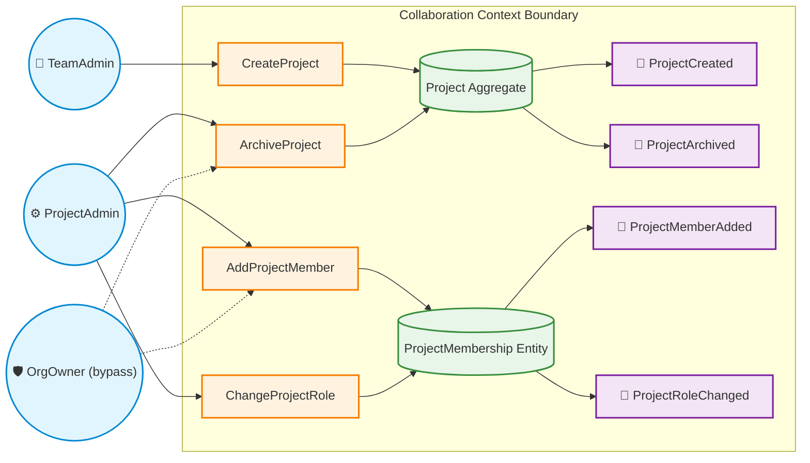

# Domain Model Specification: Collaboration Context

## 0. Purpose

This module represents the core domain that delivers direct business value to the end user. It is responsible for **work organization, project management, and progress tracking**. It operates exclusively on top of the secure context provided by the _Tenant Context_ (requiring an active _Tenant-bound Session_) and remains entirely unaware of global identity management. It answers the question: _"What are we working on, and who is allowed to view or modify it?"_.

### Core Responsibilities

- **Project Lifecycle:** Creating and managing projects assigned to specific teams within an organization.
- **Granular Access Control:** Enforcing fine-grained project permissions (`ProjectMembership`: `Admin`, `Contributor`, `Viewer`) to enable secure collaboration.
- **Task Organization:** _(Roadmap)_ Structuring, assigning, and tracking tasks (`Tasks`/`Boards`) within active projects.
- **Operational Read Models:** Aggregating data for high-performance operational views (e.g., _MyWork_, _MyTeam_, _Project Board_).

---

## 1. Actors

- **OrgMember**: A User holding an active membership in the Organization.
- **OrgAdmin**: A User holding either the `Owner` or `Admin` role in the Organization.
- **OrgOwner**: A User holding the `Owner` role in the Organization.
- **TeamAdmin**: A User holding the `Admin` role within a specific Team.
- **TeamMember**: A User holding a membership within a specific Team.
- **ProjectAdmin**: A User holding the `Admin` role within a specific Project.
- **Contributor**: A User allowed to create and edit content within a Project.
- **Viewer**: A User with read-only access to a Project.
- **System**: Automated background processes, scheduled handlers, or event consumers.

---

## 2. Aggregates & Invariants

### Team (Aggregate Root)

- `Team.id` must be unique across the system.
- Team name must be unique within the parent Organization.
- `Team.activeProjectCount <= MAX_PROJECT_COUNT - ACTIVE_PROJECT_COUNT`.
- A Team cannot be deleted or archived if any associated Project is currently active and owned by it.

---

### TeamMembership (Entity)

- Represents the relationship between a `User` and a `Team`.
- `TeamMembership(userId, teamId)` pair must be unique.
- `TeamMembership.state` $\in$ `{Active, Removed}`.
- `TeamMembership.role` $\in$ `{Admin, Member}`.
- Creating or maintaining a `TeamMembership` requires an active Organization Membership (`Membership.state == Active`).

---

### Project (Aggregate Root)

- `Project.id` must be unique across the system.
- Project must belong to **exactly one** Organization.
- Project must belong to **exactly one** Team.
- A Project cannot exist, be created, or be activated if the parent Organization is archived (`Organization.archived == true`).

---

### ProjectMembership (Entity)

- Represents explicit access rights for a `User` or `Team` within a `Project`.
- `ProjectMembership(userId, projectId)` pair must be unique.
- `ProjectMembership.role` $\in$ `{Admin, Contributor, Viewer}`.
- Creating or maintaining a `ProjectMembership` requires an active Organization Membership (`Membership.state == Active`).
- Access can be explicitly granted to individual Users or inherited via Team membership.

---

## 3. State Machines

### Team

- **States:** `Draft`, `Active`, `Archived`
- **Transitions:**
  - `Draft` -> `Active` via `CreateTeam`
  - `Active` -> `Archived` via `ArchiveTeam`
  - `Archived` -> `Active` via `RestoreTeam`

---

### TeamMembership

- **States:** `Draft`, `Active`, `Removed` _(Terminal)_
- **Transitions:**
  - `Draft` -> `Active` via `AddTeamMember`
  - `Active` -> `Removed` via `RemoveTeamMember`

---

### Project

- **States:** `Draft`, `Active`, `Archived`
- **Transitions:**
  - `Draft` -> `Active` via `CreateProject`
  - `Active` -> `Archived` via `ArchiveProject`
  - `Archived` -> `Active` via `RestoreProject`

---

### ProjectMembership

- **States:** `Draft`, `Active`, `Removed` _(Terminal)_
- **Transitions:**
  - `Draft` -> `Active` via `AddProjectMember`
  - `Active` -> `Removed` via `RemoveProjectMember`

---

## 4. Commands

### Team Commands

#### Command: `CreateTeam`

- **Actor:** OrgAdmin / OrgOwner
- **Target:** Organization / Team
- **Preconditions:**
  - `Organization.archived == false`
  - `Team.name` is unique within the Organization
- **Effects:**
  - Create `Team` (`state = Active`)
- **Emit:** `TeamCreated`
- **Errors:** `DuplicateTeamName`, `OrganizationArchived`

#### Command: `ArchiveTeam`

- **Actor:** OrgAdmin / OrgOwner
- **Target:** Team
- **Preconditions:**
  - `Team.archived == false`
  - `Team.activeProjectCount == 0`
- **Effects:**
  - `Team.archived = true`
- **Emit:** `TeamArchived`
- **Errors:** `AlreadyArchived`, `ActiveProjectsExist`

#### Command: `RestoreTeam`

- **Actor:** OrgAdmin / OrgOwner
- **Target:** Team
- **Preconditions:**
  - `Team.archived == true`
  - `Organization.archived == false`
- **Effects:**
  - `Team.archived = false`
- **Emit:** `TeamRestored`
- **Errors:** `OrganizationArchived`, `NotArchived`

---

### TeamMembership Commands

#### Command: `AddTeamMember`

- **Actor:** TeamAdmin
- **Target:** Team
- **Preconditions:**
  - Target User has active Organization Membership (`Membership.state == Active`)
  - `TeamMembership(userId, teamId)` does not exist
- **Effects:**
  - Create `TeamMembership` (`state = Active`, `role = AssignedRole`)
- **Emit:** `TeamMemberAdded`
- **Errors:** `MembershipRequired`, `AlreadyExists`

#### Command: `RemoveTeamMember`

- **Actor:** TeamAdmin
- **Target:** TeamMembership
- **Preconditions:**
  - `TeamMembership.state == Active`
- **Effects:**
  - `TeamMembership.state = Removed`
- **Emit:** `TeamMemberRemoved`
- **Errors:** `AlreadyRemoved`

#### Command: `ChangeTeamRole`

- **Actor:** TeamAdmin
- **Target:** TeamMembership
- **Preconditions:**
  - `TeamMembership.state == Active`
  - `NewRole` $\in$ `{Admin, Member}`
- **Effects:**
  - `TeamMembership.role = NewRole`
- **Emit:** `TeamRoleChanged`
- **Errors:** `InvalidRole`, `MemberNotFound`

---

### Project Commands

#### Command: `CreateProject`

- **Actor:** TeamAdmin
- **Target:** Team
- **Preconditions:**
  - `Organization.archived == false`
  - `Team.archived == false`
  - `Team.activeProjectCount < MAX_PROJECT_COUNT`
- **Effects:**
  - Create `Project` (`state = Active`)
  - `Team.activeProjectCount += 1`
- **Emit:** `ProjectCreated`
- **Errors:** `OrganizationArchived`, `TeamArchived`, `ProjectLimitReached`

#### Command: `ArchiveProject`

- **Actor:** ProjectAdmin
- **Target:** Project
- **Preconditions:**
  - `Project.archived == false`
- **Effects:**
  - `Project.archived = true`
  - `Team.activeProjectCount -= 1`
- **Emit:** `ProjectArchived`
- **Errors:** `AlreadyArchived`

#### Command: `RestoreProject`

- **Actor:** ProjectAdmin
- **Target:** Project
- **Preconditions:**
  - `Project.archived == true`
  - `Organization.archived == false`
  - `Team.archived == false`
- **Effects:**
  - `Project.archived = false`
  - `Team.activeProjectCount += 1`
- **Emit:** `ProjectRestored`
- **Errors:** `OrganizationArchived`, `TeamArchived`, `NotArchived`

---

### ProjectMembership Commands

#### Command: `AddProjectMember`

- **Actor:** ProjectAdmin
- **Target:** Project
- **Preconditions:**
  - Target User has active Organization Membership (`Membership.state == Active`)
  - `ProjectMembership(userId, projectId)` does not exist
- **Effects:**
  - Create `ProjectMembership` (`state = Active`, `role = AssignedRole`)
- **Emit:** `ProjectMemberAdded`
- **Errors:** `MembershipRequired`, `AlreadyExists`

#### Command: `RemoveProjectMember`

- **Actor:** ProjectAdmin
- **Target:** ProjectMembership
- **Preconditions:**
  - `ProjectMembership.state == Active`
- **Effects:**
  - `ProjectMembership.state = Removed`
- **Emit:** `ProjectMemberRemoved`
- **Errors:** `AlreadyRemoved`

#### Command: `ChangeProjectRole`

- **Actor:** ProjectAdmin
- **Target:** ProjectMembership
- **Preconditions:**
  - `ProjectMembership.state == Active`
  - `NewRole` $\in$ `{Admin, Contributor, Viewer}`
- **Effects:**
  - `ProjectMembership.role = NewRole`
- **Emit:** `ProjectRoleChanged`
- **Errors:** `InvalidRole`

---

## 5. Domain Events

### Team Events

- **`TeamCreated`**  
  _Payload:_ `teamId`, `organizationId`, `name`
- **`TeamArchived`**  
  _Payload:_ `teamId`, `organizationId`
- **`TeamRestored`**  
  _Payload:_ `teamId`, `organizationId`

---

### TeamMembership Events

- **`TeamMemberAdded`**  
  _Payload:_ `teamId`, `userId`, `role`
- **`TeamMemberRemoved`**  
  _Payload:_ `teamId`, `userId`
- **`TeamRoleChanged`**  
  _Payload:_ `teamId`, `userId`, `oldRole`, `newRole`

---

### Project Events

- **`ProjectCreated`**  
  _Payload:_ `projectId`, `teamId`, `organizationId`, `name`
- **`ProjectArchived`**  
  _Payload:_ `projectId`, `teamId`, `organizationId`
- **`ProjectRestored`**  
  _Payload:_ `projectId`, `teamId`, `organizationId`

---

### ProjectMembership Events

- **`ProjectMemberAdded`**  
  _Payload:_ `projectId`, `userId`, `role`
- **`ProjectMemberRemoved`**  
  _Payload:_ `projectId`, `userId`
- **`ProjectRoleChanged`**  
  _Payload:_ `projectId`, `userId`, `oldRole`, `newRole`
